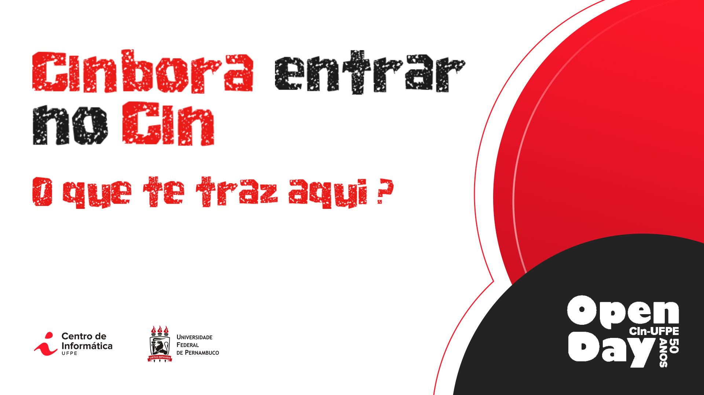
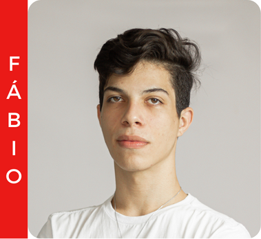

<h1 style="color: #EA1A17; border-bottom: 100px solid #ccc; padding-bottom: 50px;">CInbora Entrar no CIn - CIn Open Day 50 anos</h1>

## Descrição

<b>CInbora</b> é um projeto dos alunos <b>Fábio Filho</b>, <b>Lucas Azevedo</b> e <b>Sara Araujo</b>, do curso de Sistemas de Informação do <b>Centro de Informática da Universidade Federal de Pernambuco</b>. CInbora foi um projeto voltado aos estudantes do ensino médio que estão na fase de realizar vestibular e fornece uma visão sobre o Centro de Informática da UFPE.

## ✒️ Autores

| [ Fábio Filho](https://github.com/FabinhoFarias) | [ Sara Araujo](https://github.com/SaraEmilay) | [ Lucas Azevedo]() |
| :----------------------------------------------------------------------------------------------------------------------------------------: | :----------------------------------------------------------------------------------------------------------------------: | :------------------------------------------------------------------------------------------------------------------: |
